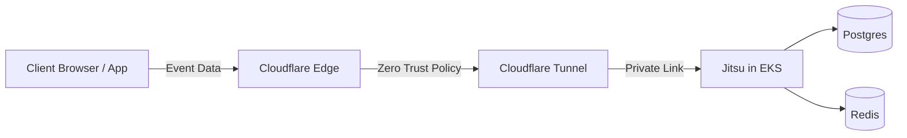

# 🚀 Jitsu on EKS with Cloudflare Zero Trust

This repository contains Kubernetes manifests and helper files to deploy **Jitsu** in an **EKS cluster**, fronted by **Cloudflare Zero Trust (Tunnel + Access)** for secure access.

---

## 📂 Repository Structure

```
Jitsu-cloudflare-setup/
│── Redis.yaml                 # Redis deployment + PVC
│── postgres.yaml              # Postgres deployment + PVC
│── jitsu.yaml                 # Jitsu core service (UI + ingestion)
│── cloudflared.yaml           # Cloudflare tunnel agent
│── Jitsu_Event_Tester.html    # Simple HTML page to send test events
```

---

## ✅ Prerequisites

* AWS EKS cluster (kubectl configured)
* Cloudflare account with Zero Trust enabled
* Domain managed in Cloudflare DNS
* Cloudflare Tunnel created in dashboard (get `TUNNEL_TOKEN`)
* (Optional) Google/Okta connected to Cloudflare Access

---

## ⚡ Deployment Steps

### 1. Create Namespace

```bash
kubectl create namespace jitsu-test
```

### 2. Deploy Postgres & Redis

```bash
kubectl apply -f postgres.yaml -n jitsu-test
kubectl apply -f Redis.yaml -n jitsu-test
```

### 3. Deploy Jitsu

```bash
kubectl apply -f jitsu.yaml -n jitsu-test
```

* Jitsu exposes:

  * **Port 8001 → UI**
  * **Port 8000 → Ingestion API**

### 4. Configure Cloudflare Tunnel

1. Create secret for your tunnel token:

```bash
kubectl create secret generic cloudflare-tunnel-secret \
  --from-literal=TUNNEL_TOKEN='<YOUR-TUNNEL-TOKEN>' \
  -n jitsu-test
```

2. Deploy Cloudflared:

```bash
kubectl apply -f cloudflared.yaml -n jitsu-test
```

---

## 🌐 Cloudflare Tunnel Setup via UI (No manual DNS needed)

### 1. Create a Tunnel

1. Go to **[Cloudflare Zero Trust Dashboard](https://one.dash.cloudflare.com/)**
2. Navigate to **Access → Tunnels**
3. Click **Create a Tunnel**
4. Select **Cloudflared** → give it a name (e.g., `jitsu-tunnel`)

### 3. Add Public Hostnames

1. In the same **Tunnel → Public Hostnames** tab, click **Add a Public Hostname**

2. Fill in:

   * **Subdomain**: `jitsu-ui`
   * **Domain**: `yourdomain.com` (managed in Cloudflare)
   * **Service Type**: HTTP
   * **URL**: `http://jitsu-ui.jitsu.svc.cluster.local:8000`

3. Add another hostname for ingest:

   * **Subdomain**: `jitsu-ingest`
   * **Domain**: `yourdomain.com`
   * **Service Type**: HTTP
   * **URL**: `http://jitsu-ingest.jitsu.svc.cluster.local:8001`

👉 When you save, Cloudflare **automatically creates DNS entries** for these hostnames (`jitsu-ui.yourdomain.com` & `jitsu-ingest.yourdomain.com`).


### 2. Zero Trust Applications

Go to **Cloudflare Zero Trust → Access → Applications**:

* **Jitsu UI (Protected)**

  * Domain: `jitsu-ui.yourdomain.com`
  * Protect with Google/Okta login

* **Jitsu Ingest (Open)**

  * Domain: `jitsu-ingest.yourdomain.com`
  * Leave unprotected (apps need to send events)

---

## 🧪 Testing

### 1. Health Check

```bash
kubectl get pods -n jitsu-test
```

Check UI:

```
https://jitsu-ui.yourdomain.com
```

Check ingestion:

```bash
curl -X POST https://jitsu-ingest.yourdomain.com/api/v1/event \
  -H "Content-Type: application/json" \
  -d '{"event_type":"test","user_id":"123"}'
```

### 2. Event Tester

Open [`Jitsu_Event_Tester.html`](./Jitsu_Event_Tester–Lqtisttist.html) in a browser.

* Pre-configured with your ingestion URL and JS key.
* Supports sending page views, identify events, and custom events.

---

## 🎯 Summary

* Jitsu backend runs inside **EKS** with Postgres + Redis.
* Cloudflare Tunnel securely exposes UI & ingestion endpoints.
* UI protected with Zero Trust login, ingestion left open for apps.
* Use included HTML tester for quick validation.


-----
## 💡 Why This Setup?

### Why Jitsu?

Jitsu is an open-source data collection platform for capturing user events and routing them to destinations (Amplitude, BigQuery, ClickHouse, S3, etc).

* ✅ Full control over event pipelines
* ✅ Can run in your own infrastructure (compliance & cost optimization)
* ✅ Integrates easily with web, mobile, and backend SDKs

---

### Why Cloudflare Zero Trust?

By default, exposing Jitsu UI or ingestion API on EKS requires a **public Load Balancer or Ingress**, which comes with:

* ❌ Extra cost (AWS Load Balancer charges per service)
* ❌ Complexity (Ingress controllers, SSL certs, DNS sync)
* ❌ Security risks (UI wide open unless locked down manually)

Instead, with **Cloudflare Tunnel + Zero Trust**:

* ✅ **No public IPs** on your cluster — traffic only enters via the tunnel
* ✅ **DNS managed automatically** by Cloudflare when you define hostnames
* ✅ **UI protection** via Access Policies (Google, Okta, GitHub login, etc)
* ✅ **Global CDN edge network** — fast, secure connections everywhere
* ✅ **Saves AWS cost** by avoiding multiple ELBs/ALBs for every microservice

---

### What’s the Idea?

We’re running Jitsu fully inside a **private EKS cluster**.

* Postgres + Redis = stateful backends
* Jitsu core = UI + ingestion endpoints
* Cloudflared = lightweight connector pod that establishes a tunnel to Cloudflare’s edge
* Cloudflare Tunnel = exposes your internal service (`svc.cluster.local`) safely to the outside world
* Cloudflare Access = adds login protection on UI, keeps ingestion API open for apps

So the flow is:



---

### Why is This a Better Solution?

* 🔒 **Security**:

  * No need to expose NodePorts or public LoadBalancers.
  * Cloudflare Access adds enterprise-grade login (SSO).
* 💰 **Cost Efficiency**:

  * Avoids AWS ALB/ELB charges for each service.
  * Cloudflare tunnel is lightweight and free.
* ⚡ **Performance**:

  * Cloudflare’s global edge network accelerates requests.
  * Reduces latency for ingestion APIs.
* 🛠 **Simplicity**:

  * No manual DNS sync; tunnels create records automatically.
  * Cleaner than running your own NGINX Ingress + Cert Manager setup.
* 🌍 **Scalability**:

  * Add more services behind the same tunnel by just defining hostnames in the Cloudflare UI.
